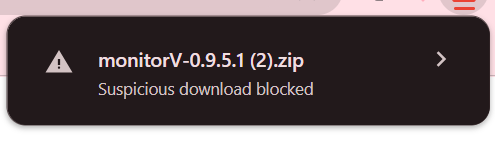

# install 

1.:
```bash
git clone https://github.com/saarors/monitor
```
2.: go to ~\monitor

3.: open "to download"

4.open monitorV-0.9.5.1.zip

4.open the monitor app.

# or:

go to `saarors.github.com/monitor` and clack "download hare".

if you see it:



so press on the file name, and click "doanload suspicious file".
